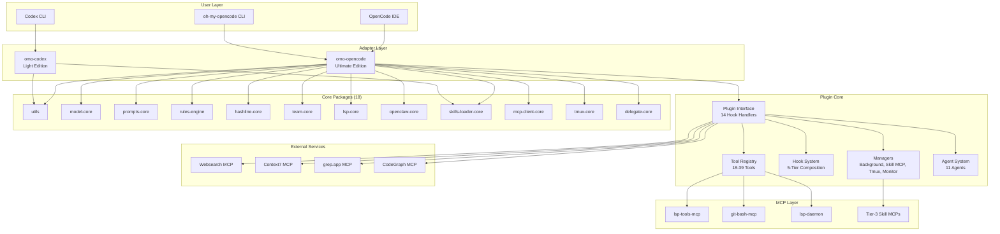
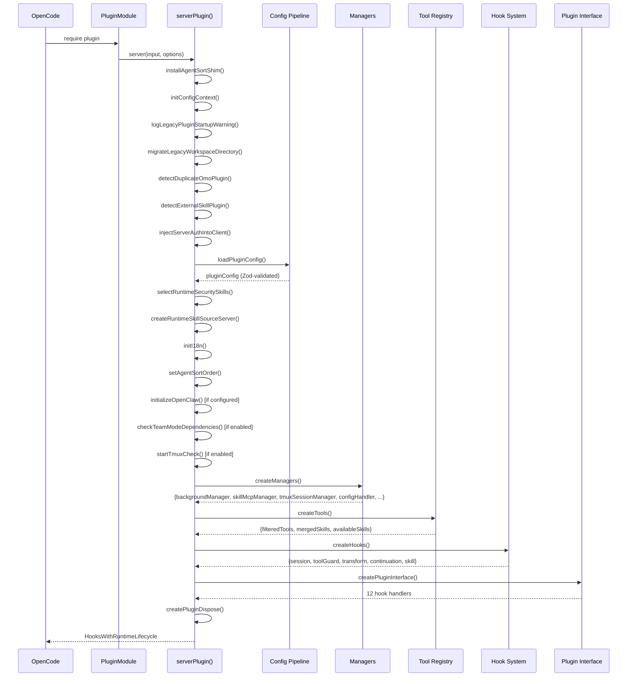
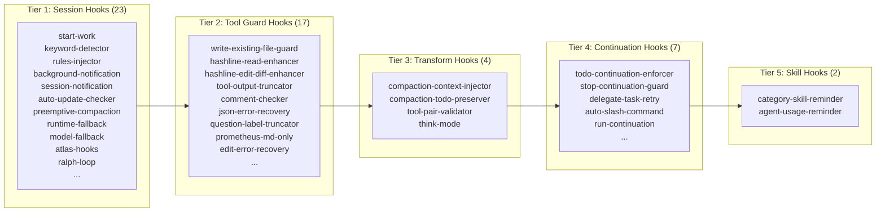
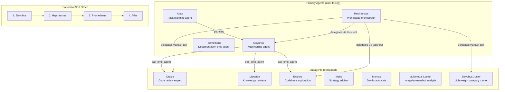
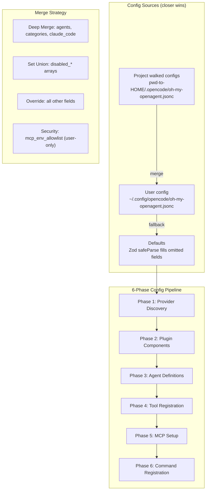
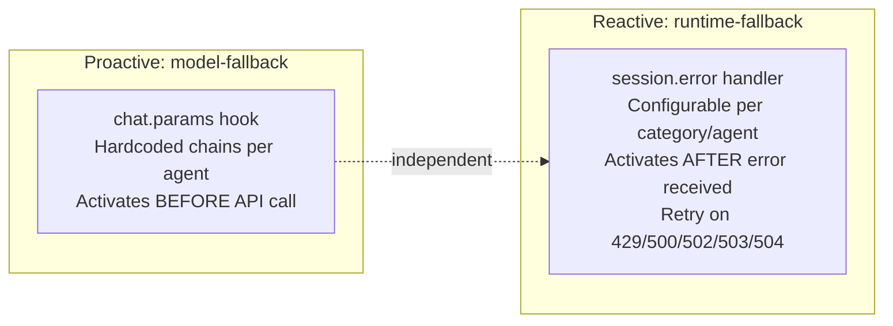
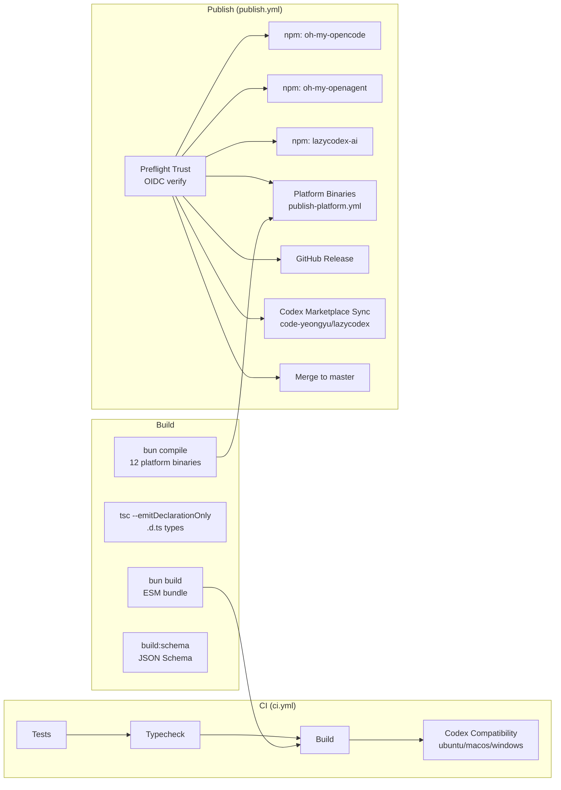
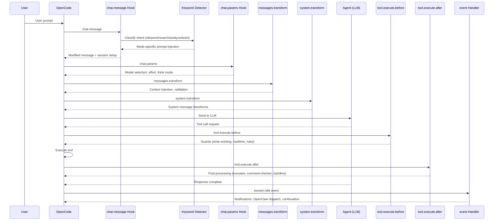

# oh-my-openagent — Overall Architecture Design Report

## 1. Executive Summary

oh-my-openagent (npm: `oh-my-opencode` / `oh-my-openagent`) is a **batteries-included AI agent harness plugin** that extends AI coding assistants (OpenCode and Codex CLI) with multi-model orchestration, parallel background agents, LSP/AST tools, and team coordination. It ships as a **monorepo with 37 packages** across 6 architectural roles, delivering two editions of one product:

- **Ultimate Edition** (`omo-opencode`): Full-featured OpenCode plugin with 11 agents, 53–60 lifecycle hooks, 20–39 tools, 3-tier MCP system, and Team Mode.
- **Light Edition** (`omo-codex` / lazycodex): Streamlined Codex CLI adapter with 8 components and minimal hook surface.

## 2. High-Level Architecture



## 3. Package Layering Architecture

The monorepo enforces a strict dependency hierarchy:

```mermaid
graph BT
    subgraph "Layer 1: Core (Pure TS, zero harness deps)"
        utils
        model-core
        prompts-core
        rules-engine
        hashline-core
        boulder-state
        telemetry-core
        lsp-core
        mcp-stdio-core
        tmux-core
        claude-code-compat-core
        skills-loader-core
        mcp-client-core
        openclaw-core
        team-core
        delegate-core
        agents-md-core
        comment-checker-core
    end

    subgraph "Layer 2: MCP (stdio servers)"
        lsp-tools-mcp
        git-bash-mcp
        lsp-daemon
    end

    subgraph "Layer 3: Skills"
        shared-skills
    end

    subgraph "Layer 4: Adapters"
        omo-opencode["omo-opencode (Ultimate)"]
        omo-codex["omo-codex (Light)"]
    end

    subgraph "Layer 5: Platform"
        platform-binaries["12 Platform Binaries"]
    end

    subgraph "Layer 6: Web"
        web["Marketing Site (Next.js)"]
    end

    lsp-tools-mcp --> lsp-core
    lsp-tools-mcp --> mcp-stdio-core
    lsp-daemon --> lsp-core
    lsp-daemon --> mcp-stdio-core
    omo-opencode --> utils
    omo-opencode --> model-core
    omo-opencode --> prompts-core
    omo-opencode --> rules-engine
    omo-opencode --> hashline-core
    omo-opencode --> boulder-state
    omo-opencode --> telemetry-core
    omo-opencode --> lsp-core
    omo-opencode --> tmux-core
    omo-opencode --> claude-code-compat-core
    omo-opencode --> skills-loader-core
    omo-opencode --> mcp-client-core
    omo-opencode --> openclaw-core
    omo-opencode --> team-core
    omo-opencode --> delegate-core
    omo-opencode --> agents-md-core
    omo-opencode --> comment-checker-core
    omo-codex --> utils
    omo-codex --> shared-skills
    platform-binaries --> omo-opencode
```



## 4. Plugin Initialization Flow



## 5. Five-Tier Hook Composition

The hook system is the backbone of the plugin, organized into 5 tiers:



**Team Mode adds:** +1 ToolGuard (`team-tool-gating`), +2 Transform (`team-mode-status-injector`, `team-mailbox-injector`), +4 event handlers → **60 total hooks**.

## 6. Agent Architecture



## 7. Configuration System



**Schema:** 32 Zod v4 schema files in `packages/omo-opencode/src/config/schema/`, auto-generated as JSON Schema at `assets/oh-my-opencode.schema.json`.

## 8. Three-Tier MCP System

```mermaid
graph TD
    subgraph "Tier 1: Built-in MCPs"
        WS[websearch<br/>Remote HTTP]
        C7[context7<br/>Remote HTTP]
        GA[grep_app<br/>Remote HTTP]
        LSP[lsp<br/>Local stdio]
        CG[codegraph<br/>Local stdio]
    end

    subgraph "Tier 2: Claude Code MCPs"
        CC[".mcp.json (project + user)<br/>env var expansion via allowlist"]
    end

    subgraph "Tier 3: Skill-Embedded MCPs"
        SM["SkillMcpManager<br/>Per-session isolation<br/>stdio + HTTP<br/>OAuth 2.0 + PKCE + DCR"]
    end

    subgraph "Loaders"
        L1[createBuiltinMcps()]
        L2[claude-code-mcp-loader]
        L3[SkillMcpManager]
    end

    L1 --> WS
    L1 --> C7
    L1 --> GA
    L1 --> LSP
    L1 --> CG
    L2 --> CC
    L3 --> SM
```

**Key invariant:** Per-session MCP isolation — Tier-3 MCP clients keyed by `${sessionID}:${skillName}:${serverName}`.

## 9. Tool System

| Category       | Tools                                                                                                            | Gate                       |
| -------------- | ---------------------------------------------------------------------------------------------------------------- | -------------------------- |
| Always On (18) | `lsp_*` (6), `grep`, `glob`, `session_*` (4), `background_*` (2), `call_omo_agent`, `task`, `skill`, `skill_mcp` | None                       |
| Conditional    | `look_at`                                                                                                        | multimodal-looker enabled  |
| Conditional    | `interactive_bash`                                                                                               | tmux binary on PATH        |
| Conditional    | `task_*` (4)                                                                                                     | `experimental.task_system` |
| Conditional    | `edit` (hashline)                                                                                                | `hashline_edit: true`      |
| Conditional    | `team_*` (12)                                                                                                    | `team_mode.enabled`        |

## 10. Team Mode Architecture

```mermaid
graph TD
    subgraph "Team Coordination"
        TC[Team Config<br/>~/.omo/teams/{name}/config.json]
        TS[Team State<br/>state.json]
        MB[Mailbox<br/>mailbox/ directory]
        TL[Tasklist<br/>tasklist.jsonl]
        WT[Worktrees<br/>worktrees/ per-member git worktrees]
    end

    subgraph "Member Types"
        SA[kind: subagent_type<br/>Direct agent invocation]
        CT[kind: category<br/>Routed through sisyphus-junior]
    end

    subgraph "Eligible Agents"
        E1[sisyphus ✓]
        E2[atlas ✓]
        E3[sisyphus-junior ✓]
        E4[hephaestus ⚠️ conditional]
    end

    TC --> TS
    TC --> MB
    TC --> TL
    TC --> WT
    SA --> E1
    SA --> E2
    SA --> E3
    CT --> E3
```

**Constraints:** max 4 parallel members (configurable 1–8), max 8 total members, 3s mailbox poll interval.

## 11. Dual Fallback Systems



## 12. Build & Deploy Pipeline



## 13. Data Flow: Message Lifecycle



## 14. Security Architecture

| Layer               | Mechanism                                                         |
| ------------------- | ----------------------------------------------------------------- |
| Config isolation    | `mcp_env_allowlist` is user-only; walked configs cannot extend it |
| File safety         | `write-existing-file-guard` prevents writes without prior read    |
| Edit integrity      | Hashline `LINE#ID` content hashes validate before apply           |
| Agent containment   | Prometheus restricted to `.md` files only                         |
| MCP isolation       | Per-session client keying prevents state leakage                  |
| Auth injection      | Server auth injected into SDK client at startup                   |
| Duplicate detection | Early-exit if duplicate plugin detected                           |
| Process cleanup     | Background-agent error handlers are log-only (no force-exit)      |
| Team gating         | Tool-level access control for team operations                     |

## 15. Key Architecture Invariants

1. **Canonical agent order:** Sisyphus → Hephaestus → Prometheus → Atlas (enforced by `installAgentSortShim()`)
2. **Hashline edit + read pairing:** Every Read tagged with `LINE#ID`; edits rejected on stale hash
3. **5-tier hook composition:** Session + ToolGuard + Transform + Continuation + Skill
4. **Per-session MCP isolation:** `${sessionID}:${skillName}:${serverName}` keying
5. **Two independent fallback systems:** model-fallback (proactive) vs runtime-fallback (reactive)
6. **OpenClaw bidirectional:** Outbound dispatchers on session events; inbound daemon polls
7. **Prompt-async gate:** All `session.prompt`/`session.promptAsync` must go through shared gate

## 16. Technology Stack

| Concern            | Technology                                          |
| ------------------ | --------------------------------------------------- |
| Runtime            | Bun 1.3.12                                          |
| Language           | TypeScript (strict, ESNext)                         |
| Schema validation  | Zod v4                                              |
| Type checking      | tsgo (@typescript/native-preview)                   |
| Test framework     | Bun test (`bun:test`)                               |
| Build              | `bun build` (ESM) + `bun compile` (binaries)        |
| Module resolution  | Bundler (no path aliases except `packages/web/`)    |
| CI                 | GitHub Actions                                      |
| Package manager    | Bun workspaces                                      |
| Platform targeting | 12 binaries (darwin/linux/windows × arch × variant) |
